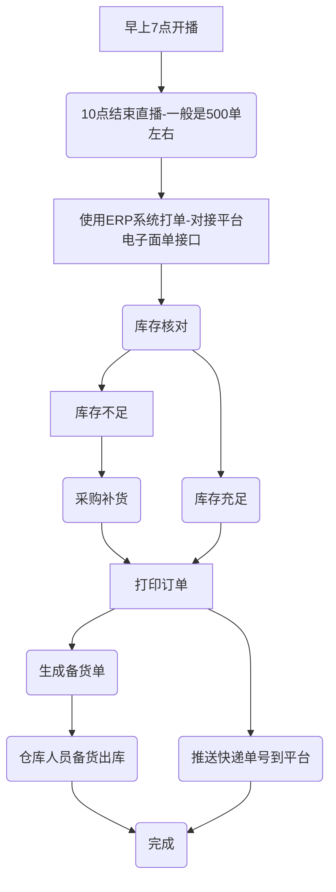
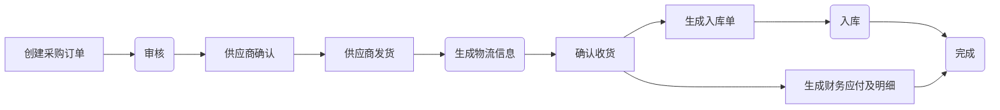
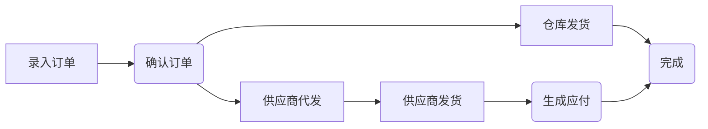
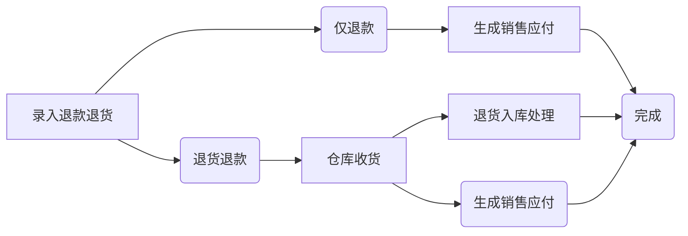

# 启航电商ERP系统

启航电商ERP系统是一套为中小电商企业构建的一套简单、实用、覆盖全流程的电商系统，本项目采用Java SpringBoot+Vue2前后端分离开发。 

**Dubbo版本请移步：** 

[https://gitee.com/qiliping/qihangerp-dubbo](https://gitee.com/qiliping/qihangerp-dubbo)

支持供应商一件代发和仓库发货两种发货方式，功能覆盖采购、网店订单处理、供应商一件代发、仓库发货、网店售后、网店商品管理、仓库出入库、采购结算、代发结算等功能，基本上覆盖了电商日常业务。 

支持的电商平台有：淘宝、京东、拼多多、抖店、视频号小店、快手、小红书。

## 项目介绍
**启航电商ERP可以说是我这五年以来的工作经验成果。**

公司从2019年踏入电商以来，一直都是由我组建和带领一帮技术人员从零开始建设了一套完全适应公司业务需要的电商ERP系统，包括WMS仓库系统、OMS订单处理系统、财务系统、直播运营系统等子系统组成。主要功能模块包括：采购模块、出入库模块、订单发货模块、网店订单管理模块、电子面单打印模块。公司ERP对接了批批网、1688、蘑菇街、淘宝天猫、拼多多、抖店、快手小店平台。

### 公司应用场景一：抖店直播

## 一、功能模块
### 供应链管理
+ 供应商管理：管理供应商信息
+ 采购订单管理：管理采购流程，包括供应商选择、采购订单生成、采购合同管理等。
+ 采购账单管理
+ 采购退货管理
+ 采购物流管理：跟踪采购订单物流信息。
+ 供应商代发管理：管理一件代发订单。
+ 代发账单管理

**采购流程**

### 订单管理
+ 创建订单：手动创建订单。
+ 店铺订单管理：处理和管理多平台订单的流程，包括订单录入、处理、发货等。
  + 支持淘宝、拼多多、抖店、快手小店、小红书平台订单接口；
  + 支持淘宝订单excel导入；
  + 支持手动添加订单；
  + 订单确认到仓库；
+ 订单查询：查询所有订单信息。
+ 店铺管理：管理店铺信息、店铺商品上下架信息等。

**订单处理流程**

### 发货管理
+ 订单备货：生成拣货单；
+ 拣货出库：拣货出库、生成出库单减库存；
+ 打包发货：记录包裹信息、物流发货、同步发货状态；
+ 物流跟踪：跟踪发货快递物流；
+ 供应商代发管理：管理供应商代发的订单

**发货流程**

### 售后管理
对退货、换货、维修等售后处理进行管理，包括退款审核、退货入库、退款处理等环节。
+ 店铺售后管理：处理和管理多平台售后包括录入售后数据、退货入库、换货处理等。
  + 支持拼多多、抖店、快手小店、小红书平台售后接口；
  + 支持手动录入、备注；
+ 退货处理：数据录入、仓库收货确认、库存处理等。
+ 换货处理：数据录入、仓库收货确认、仓库发货、库存处理等。

**退款退货流程**

### 店铺管理
+ 淘宝商品管理：同步淘宝店铺商品，关联到ERP商品（用于仓库发货处理）；
+ 多多商品管理：同步多多店铺商品，关联到ERP商品（用于仓库发货处理）；
+ 抖店商品管理：同步抖店店铺商品，关联到ERP商品（用于仓库发货处理）；
+ 店铺设置：网店管理、API参数设置；

### 库存管理

+ 入库管理
+ 出库管理
+ 库存查询：跟踪和管理库存，包括批次管理、库存盘点、库存调整、库存预警等。
+ 库位管理

### 商品管理
商品信息、分类信息、属性信息等管理。

## 二、项目说明

**项目采用SpringBoot+vue2开发。具体使用方法如下**

#### 2.1 配置启动MySQL

+ 创建数据库`qihang-erp`并导入sql脚本`docs\sql\qihang-erp.sql`

#### 2.2 启动minio（可选）
+ minio文件存储

#### 2.3 启动后端api
+ 修改`api`项目中的配置文件`application.yml`配置`MySQL`数据库相关。

#### 2.4 启动前端 `vue`
+ `npm install`
+ `npm run dev`
+ 打包`npm run build:prod`
+ 访问web
  + 访问地址：`http://localhost`
  + 登录名：`admin`
  + 登录密码：`admin123`

## 三、支持作者

**感谢大家的关注与支持！希望利用本人从事电商10余年的经验帮助到大家提升工作效率！**

💖 如果觉得有用记得点 Star⭐

### 3.1 捐助支持
作者为兼职做开源,平时还需要工作,如果帮到了您可以请作者吃个盒饭

### 3.2 有偿服务
+ 提供部署服务
+ 提供演示包服务
+ 提供定制化开发服务
+ 提供系统培训服务
+ 提供版本商业化支持服务

### 3.3 关注公众号

作者微信公众号：qihangerp168

💖 欢迎一起交流！ 

