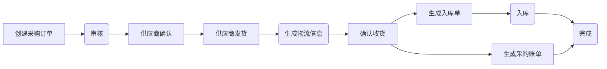
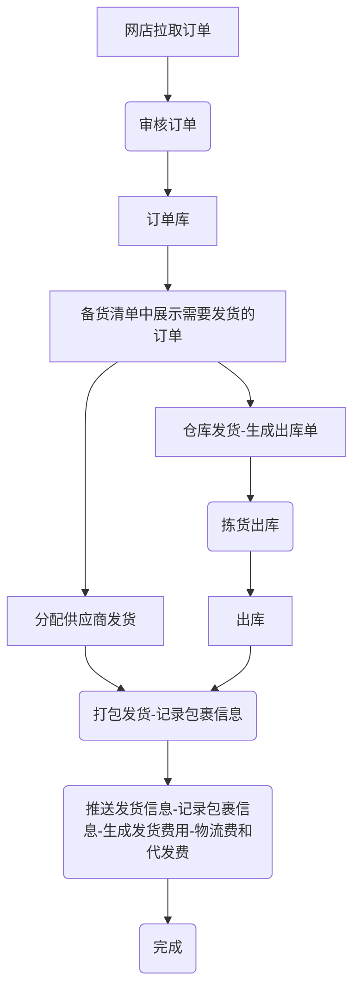
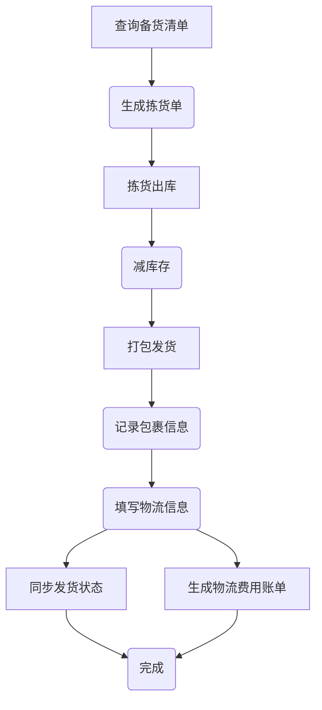
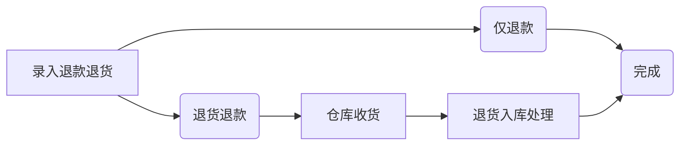
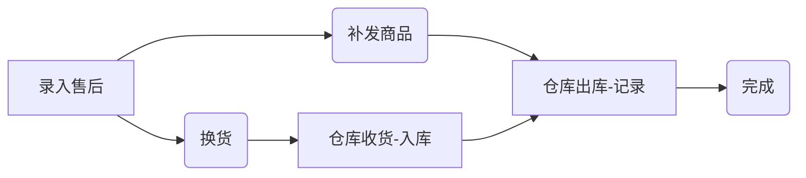
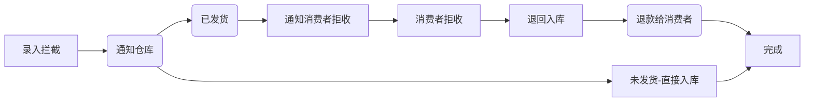

# 启航电商ERP系统

启航电商ERP系统是一套为中小电商企业构建的一套简单、实用、覆盖全流程的电商系统，本项目采用Java SpringBoot3+Vue2前后端分离开发。 

支持供应商一件代发和仓库发货两种发货方式，功能覆盖：
+ 采购管理
+ 订单管理
+ 发货管理：供应商一件代发、仓库发货
+ 售后管理
+ 库存管理
+ 店铺管理
+ 商品管理
+ 系统设置

**基本上覆盖了电商日常业务。** 

目前支持的电商平台有：淘宝、京东、拼多多、抖店、视频号小店，后续计划继续支持快手、小红书等。

## 一、项目介绍
**启航电商ERP可以说是我多年电商行业从业经验积累的成果。**

公司从2019年踏入电商以来，一直都是由我组建和带领一帮技术人员从零开始建设了一套完全适应公司业务需要的电商ERP系统，包括WMS仓库系统、OMS订单处理系统、财务系统、直播运营系统等子系统组成。核心模块包括：采购模块、出入库模块、订单发货模块、电子面单打印模块等。

公司ERP对接了批批网、1688、蘑菇街、淘宝、拼多多、抖店、快手小店平台。

### 主要技术及组件
+ Java17
+ SpringBoot3
+ Redis
+ Nacos
+ MyBatis-Plus
+ MySQL8

### 主要应用场景
+ 订单处理
+ 库存管理
+ 售后处理

### 开发计划
+ [x] 采购--入库--出库--售后全流程拉通；
+ 对接电商平台商品、订单、售后数据
  + [x] 淘宝
  + [x] 京东
  + [x] 拼多多
  + [x] 抖店
  + [x] 微信视频号
  + [ ] 快手小店
  + [ ] 小红书
+ [ ] 电子面单打印
  + [ ] 淘宝
  + [ ] 京东
  + [ ] 拼多多
  + [ ] 抖店
  + [x] 微信视频号
  + [ ] 快手小店
  + [ ] 小红书

## 二、功能模块
### 2.1 采购管理
+ 采购单管理：管理采购流程，包括供应商选择、采购单生成、采购单审核等。
+ 采购物流管理：跟踪采购订单物流信息。
+ 采购账单管理
+ 供应商管理：管理供应商信息

**采购流程**

### 2.2 订单管理
+ 订单处理：处理所有订单；
  + 手动创建订单
  + 订单查询管理
  
+ 店铺订单导入：处理和管理多平台原始订单。
  + 支持淘宝、京东、拼多多、抖店、微信视频号小店平台订单接口拉取（后续继续对接、快手小店、小红书等）；
  + 确认(审单)订单，审核之后订单到统一订单库；
  + 更新订单，更新订单信息和状态

### 2.3 发货管理
+ 备货清单：展示需要发货的订单明细
  + 生成出库单
+ 拣货出库：拣货出库、生成出库单减库存；
+ 打包发货：记录包裹信息、物流发货、同步发货状态；包括仓库发货、供应商发货；
+ 物流跟踪：跟踪发货快递物流；
+ 发货费用：管理发货的费用，包括仓库发货快递费和供应商发货账单；
+ 物流公司管理：管理发货使用的物流公司；

**订单发货流程**

**仓库发货流程**

### 2.4 售后管理
对退货、换货、维修等售后处理进行管理，包括退款审核、退货入库、退款处理等环节。
+ 售后处理：几种处理所有店铺售后，包括：取消订单、补发、退货、换货、部分退款等
+ 店铺售后管理：拉取各平台店铺售后
  + 支持淘宝、京东、拼多多、抖店（后续继续支持快手小店、小红书等）；
+ 售后处理查询：查询售后处理结果；

**退货退款流程**

**售后流程**

**订单拦截**

### 2.5 库存管理

+ 入库管理
+ 出库管理
+ 库存查询：跟踪和管理库存，包括批次管理、库存盘点、库存调整、库存预警等。
+ 库位管理

### 2.6店铺管理
+ 店铺商品管理
  + 淘宝商品管理：同步淘宝店铺商品，关联到ERP商品（用于仓库发货处理）；
  + 多多商品管理：同步多多店铺商品，关联到ERP商品（用于仓库发货处理）；
  + 抖店商品管理：同步抖店店铺商品，关联到ERP商品（用于仓库发货处理）；
  + 京东、视频号、快手、小红书同上
+ 店铺管理：网店管理、API参数设置；

### 2.7 商品管理
商品信息、分类信息、属性信息等管理。

### 2.8 系统设置
+ 电商平台设置：平台参数设置；
+ 用户管理：管理登录用户

## 三、部署说明

**项目采用SpringBoot+vue2开发。具体使用方法如下**

#### 3.1 配置启动MySQL

+ 创建数据库`qihang-erp`
  + 1、导入数据库结构：sql脚本`docs\qihang-erp.sql`
  + 2、导入系统数据：sql脚本`docs\qihang-erp-sys.sql`

#### 3.2 启动Redis
项目开发采用Redis7

#### 3.3 启动后端api

+ 修改`api`项目中的配置文件`application.yml`配置`Mysql`相关配置。

+ IDE启动项目

#### 3.4 启动前端 `vue`
+ `npm install`
+ `npm run dev`
+ 打包`npm run build:prod`
+ 访问web
  + 访问地址：`http://localhost`
  + 登录名：`admin`
  + 登录密码：`admin123`

## 四、支持作者

**感谢大家的关注与支持！希望利用本人从事电商10余年的经验帮助到大家提升工作效率！**

💖 如果觉得有用记得点 Star⭐

### 4.1 有偿服务
+ [提供本地部署服务](https://mp.weixin.qq.com/s/8U4NvMiAP0vDsTDBzlHJbw)
+ [提供一键演示包](https://mp.weixin.qq.com/s/MtXFijnq0Ti461hO5Sulhw)
+ [提供定制化开发服务](https://mp.weixin.qq.com/s/U-1FKfa84Dfz17WL9GHyqw)
+ [提供电商系统软著代申请服务（文档、源代码）](https://mp.weixin.qq.com/s/8N1PeNHw9jCBR__AsSjeqg)

### 4.2 更多服务

更多服务，请关注作者微信公众号：qihangerp168

💖 欢迎一起交流！ 

### 4.3 捐助支持
作者为兼职做开源,平时还需要工作,如果帮到了您可以请作者吃个盒饭

### 4.4 获取一键演示包

启航电商ERP系统自从开源以来，收到很多兄弟们的关注，也很多兄弟们想看演示效果，由于项目是非商业化的没有财力去支撑演示环境服务器，为了满足兄弟们想看系统演示，作者特地制作了一个一键演示包，获取之后直接在Windows电脑中即可运行。

[一键演示包获取地址](https://mp.weixin.qq.com/s/MtXFijnq0Ti461hO5Sulhw)
