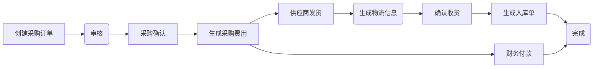
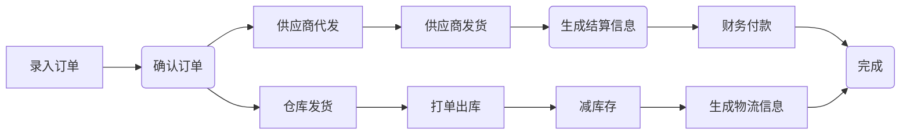
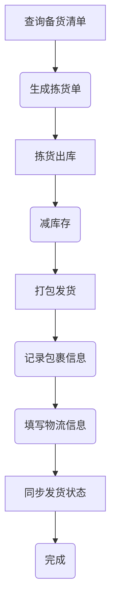

# 启航电商ERP系统

启航电商ERP系统是一套为中小电商企业构建的ERP系统，本项目目标是构建一套简单实用的电商ERP系统，采用Java SpringBoot+Vue2开发。

主体流程覆盖采购、供应商代发管理、网店订单发货、网店售后、仓库出入库、采购结算、网店账单管理等功能，基本上覆盖了电商日常业务。

## 一、功能模块
### 供应链管理
+ 供应商管理：管理供应商信息
+ 采购订单管理：管理采购流程，包括供应商选择、采购订单生成、采购合同管理等。
+ 采购物流管理：跟踪采购订单物流信息。
+ 采购费用管理：管理采购费用、付款等。
+ 供应商代发管理：
+ 代发结算：

#### 采购流程

### 销售管理
+ 创建订单：手动创建订单。
+ 店铺订单管理：处理和管理多平台订单的流程，包括订单录入、处理、发货等。
  + 支持拼多多、抖店、快手小店、小红书平台订单接口；
  + 支持淘宝订单excel导入；
  + 支持手动添加订单；
  + 订单确认到仓库；
+ 订单查询：查询所有订单信息。
+ 店铺管理：管理店铺信息、店铺商品上下架信息等。

#### 订单处理流程

### 发货管理
+ 订单备货：生成拣货单；
+ 拣货出库：拣货出库、生成出库单减库存；
+ 打包发货：记录包裹信息、物流发货、同步发货状态；
+ 物流跟踪：跟踪发货快递物流；

##### 发货流程

### 售后管理
对退货、换货、维修等售后处理进行管理，包括退款审核、退货入库、退款处理等环节。
+ 店铺售后管理：处理和管理多平台售后包括录入售后数据、退货入库、换货处理等。
  + 支持拼多多、抖店、快手小店、小红书平台售后接口；
  + 支持手动录入、备注；
+ 退货处理：数据录入、仓库收货确认、库存处理等。
+ 换货处理：数据录入、仓库收货确认、仓库发货、库存处理等。

### 库存管理

+ 入库管理
+ 出库管理
+ 库存查询：跟踪和管理库存，包括批次管理、库存盘点、库存调整、库存预警等。
+ 库位管理

### 财务管理
+ 采购账单管理
+ 代发账单管理
+ 发货物流账单
+ 店铺账单管理
+ 订单付款管理：对订单付款进行实时监控和管理，包括收款、退款等流程的处理。
+ 账户管理：管理电商企业的各个账户，包括银行账户、支付宝账户、微信支付账户等，并对账户余额进行实时跟踪和管理。
+ 成本管理：对生产成本、运营成本、销售成本等进行管理和分析，帮助企业了解各项成本情况和盈利状况。
+ 应收应付管理：实时跟踪和管理应收账款和应付账款，包括对账单生成、账期管理、欠款提醒等功能。

### 客户管理
+ 客户管理：对客户信息进行管理，包括客户档案、客户历史订单信息、客户反馈等内容。

### 商品管理
商品信息、分类信息、属性信息等管理。

### 市场洞察
+ 数据采集：行业信息采集、热搜词采集、商品榜单采集、其他采集；
+ 数据分析：收集和分析数据，帮助企业做出决策和优化运营。
+ 统计报表：生成各种报表和统计数据，用于监控业务和分析绩效。

## 二、技术栈
### 1、技术栈
+ vue2 + elementUI
+ SpringBoot2.x
+ Java 17

### 2、存储栈
+ MySQL8zz数据库
+ minio文件存储
+ Redis（缓存：在线用户、字典、系统配置）

### 3、其他
+ quartz定时任务

## 三、如何使用？
### 0、开发环境配置
+ MySQL导入数据`db\sql\mysql\qihang-erp.sql`
+ 启动Redis
  + 进入项目redis文件夹
  + 启动：双击`start.bat`

### 1、启动后端`ecerp-api`
+ IDEA启动项目

### 2、启动前端 `ecerp-vue`
+ `npm install`
+ `npm run dev`

### 3、访问web
+ 访问地址：`http://localhost`
+ 登录名：`admin`
+ 登录密码：`admin123`
