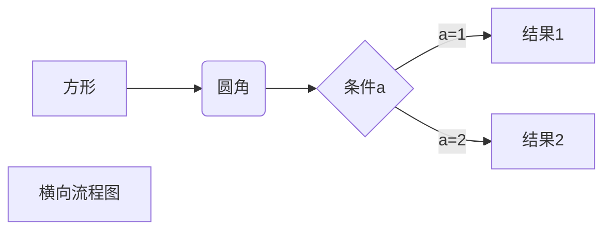

# 启航电商ERP系统

启航电商ERP系统是一套为中小电商企业构建的ERP系统，本项目目标是构建一套简单实用的电商ERP系统，采用Java SpringBoot+Vue2开发，主体模块包括：供应链管理（供应商管理、采购管理、销售管理）仓储管理（出库入库管理）、订单管理（多平台订单接口、订单物流、售后管理）、财务管理（付款管理、费用管理、对账管理）、客户管理、市场洞察（数据收集、分析）等，基本上覆盖了电商日常业务。
## 一、技术栈
### 1、技术栈
+ vue2 + elementUI + AVue
+ SpringBoot2.x
+ Java 17

### 2、存储栈
+ H2(部署支持MySQL8)
+ minio文件存储
+ Redis缓存

### 3、中间件
+ Kafka消息队列
+ Spark大数据处理

### 4、其他
+ quartz定时任务

## 二、功能模块
### 1、供应链管理ISCM
+ 供应商管理
+ 采购管理：管理采购流程，包括供应商选择、采购订单生成、采购合同管理等。
+ 物流管理
+ 库存管理：跟踪和管理库存，包括库存查询、库存预警等。
+ 销售管理：管理销售流程，包括产品定价、销售报价、销售订单管理等。
+ 成本控制

#### 1.1 采购流程

### 2、仓储管理WMS
+ 入库管理
+ 出库管理
+ 库存管理：跟踪和管理库存，包括库存盘点、库存调整、库存预警等。
+ 货位管理
+ 批次管理

### 3、订单管理OMS
+ 订单录入：处理和管理多平台订单的流程，包括订单录入、处理、发货和退款等。
  + 支持拼多多、抖店、快手小店、小红书平台订单接口；
  + 支持淘宝订单excel导入；
  + 支持手动添加订单；
+ 订单处理：对订单进行自动化处理，包括自动确认、自动审核、自动拆单、自动匹配等，极大地提高订单处理效率。
+ 库存管理：实时跟踪库存数量和状态，在出现缺货情况时自动触发补货流程，确保订单能够及时准确地交付。
+ 物流配送：支持物流信息的实时查询和跟踪，对物流配送过程进行监控和管理，确保订单能够按时到达客户手中。
+ 退款售后：对退货、换货、维修等售后处理进行管理，包括退款审核、退货入库、退款处理等环节。
+ 客户管理：对客户信息进行管理，包括客户档案、客户历史订单信息、客户反馈等内容。

### 4、财务管理EFM
+ 采购付款管理
+ 订单付款管理：对订单付款进行实时监控和管理，包括收款、退款等流程的处理。
+ 账户管理：管理电商企业的各个账户，包括银行账户、支付宝账户、微信支付账户等，并对账户余额进行实时跟踪和管理。
+ 成本管理：对生产成本、运营成本、销售成本等进行管理和分析，帮助企业了解各项成本情况和盈利状况。
+ 应收应付管理：实时跟踪和管理应收账款和应付账款，包括对账单生成、账期管理、欠款提醒等功能。

### 5、市场洞察
+ 数据采集：行业信息采集、热搜词采集、商品榜单采集、其他采集；
+ 数据分析：收集和分析数据，帮助企业做出决策和优化运营。
+ 统计报表：生成各种报表和统计数据，用于监控业务和分析绩效。

## 三、如何使用？
### 0、开发环境配置
+ 启动Redis
  + 进入项目redis文件夹
  + 启动：双击`start.bat`
+ 启动MinIO
  + 进入项目minio文件夹
  + 启动服务`minio.exe server data`
  + 访问服务`http://127.0.0.1:9000`

### 1、后端`ecerp-api`
+ 启动项目

### 2、前端 `ecerp-vue`
+ `npm install`
+ `npm run dev`

**以上2步完成后自动就有了上面说的功能**