# 启航电商ERP系统
## 新版本通知
启航电商ERP项目启动开源一年以来，经历了不少挑战与成长，得到了很多开发者兄弟们和电商从业者朋友们的关注与支持，也让我对开源项目有了更深的理解，也有了信心继续推动开源社区的建立。

近期2.0版本正在陆续更新中。

**2.0版本是一个开箱即用的版本，可以不用做任何代码修改即可使用在生产环境上。**

具体请看：[2.0版本与1.0版本的区别](https://mp.weixin.qq.com/s/jAsbYBsR7uDnj-FWSJBUwg)

另外我们提供了部署服务，有需要的朋友们可以联系作者本人。

2.0版本链接：https://gitee.com/qiliping/qihangerp


## 一、系统介绍
启航电商ERP系统是一套为电商企业构建的一套简单、实用、现代化UI的覆盖全流程的电商系统，本项目采用Java SpringBoot3+Vue2前后端分离开发。

该系统旨在构建一个稳定的、可持续的、标准化的订单处理系统，系统极力控制非标准化的个性化需求，不过您可以在系统标准API的帮助下实现自己的个性化需求。

**该系统适合想自研电商系统的企业快速构建业务，系统并不适合小卖家拿来就用的述求，使用该系统最大的门槛就是需要企业申请自己的软件著作权（作者可以提供协助）和申请各个电商开放平台的商家自研appkey**

启航电商ERP系统主要场景是：店铺商品管理、店铺订单发货、店铺售后处理、库存同步联动，支持货品先入先出。出入库都有详细的记录，适合电商企业业务处理和财务对账，可以很方便地二次开发加入财务对账模块或者通过接口与财务系统进行对接。


**支持供应商一件代发和仓库发货两种发货方式**


### 1.1 功能介绍

+ 采购管理：采购下单、采购入库、采购退货出库等。

+ 订单管理：支持手动添加订单，**支持网店订单API拉取**，目前支持的平台有：淘宝、京东、拼多多、抖店、微信小店，后续计划继续支持快手、小红书等。

+ 发货管理：支持分配给仓库发货和分配给供应商发货，**支持平台电子面单打印，包括：淘宝、京东、拼多多、抖店、微信小店**。

+ 售后管理：支持手动添加售后单，**支持网店售后API拉取**。售后处理反馈（订单拦截、订单补发、订单退货、订单换货、订单退款等）。

+ 库存管理：仓库管理，仓库出入库明细管理。

+ 店铺管理：网店管理、网店参数设置、网店商品关联（**支持网店商品API拉取**）。

+ 商品管理：商品管理、商品属性管理、商品分类管理。

+ 系统设置：登录用户设置、系统设置等。


### 1.2 主要技术及组件
+ Java17
+ SpringBoot3
+ Redis
+ Nacos
+ MyBatis-Plus
+ MySQL8

### 1.3 开发计划
+ [x] 引入OMS系统中的电子面单打印，实现打单发货一体。
+ [ ] 对接更多电商平台API
  + [x] 淘宝
  + [x] 京东
  + [x] 拼多多
  + [x] 抖店
  + [x] 微信视频号
  + [ ] 快手小店
  + [ ] 小红书


## 二、主要流程
**启航电商ERP可以说是我多年电商行业从业经验积累的成果。**

公司从2019年踏入电商以来，一直都是由我组建和带领一帮技术人员从零开始建设了一套完全适应公司业务需要的电商ERP系统，包括WMS仓库系统、OMS订单处理系统、财务系统、直播运营系统等子系统组成。核心模块包括：采购模块、出入库模块、订单发货模块、电子面单打印模块等。

公司ERP对接了批批网、1688、蘑菇街、淘宝、拼多多、抖店、快手小店平台。


### 2.1 采购流程
+ 采购单管理：管理采购流程，包括供应商选择、采购单生成、采购单审核等。
+ 采购物流管理：跟踪采购订单物流信息。
+ 采购账单管理
+ 供应商管理：管理供应商信息


**采购流程**

```mermaid
graph LR
A[创建采购订单] -->B(审核)
    B --> C[供应商确认]
    C --> E[供应商发货]
    E --> F1(生成物流信息)
    F1 --> G1[确认收货]
    G1 --> G3[生成入库单]
    G3 --> G4(入库)
    G1 --> G2[生成采购账单]
    G4 --> H(完成)
    G2 --> H

```



### 2.2 发货流程


**订单发货流程**

```mermaid
graph TD
A[网店拉取订单] -->B(审核订单)
    B --> C[订单库]
    C --> C1[备货清单中展示需要发货的订单]
    C1 --> D[仓库发货-生成出库单]
    C1 --> E[分配供应商发货]
    D --> F(拣货出库)
    F --> F1[出库]
    E --> H(打包发货-记录包裹信息)
    F1 --> H
    H --> G(推送发货信息-记录包裹信息-生成发货费用-物流费和代发费)
    G --> I(完成)
```


**仓库发货流程**

```mermaid
graph TD
A[查询备货清单] -->B(生成拣货单)
    B --> C[拣货出库]
    C --> E(减库存)
    E --> F[打包发货]
    F --> F1(记录包裹信息)
    F1 --> G(填写物流信息)
    G --> G1[同步发货状态]
    G1 --> H(完成)
    G --> G2[生成物流费用账单]
    G2 --> H

```


### 2.3 售后处理流程

**退货退款流程**

```mermaid
graph LR
A[录入退款退货] -->B(仅退款)
    B --> H(完成)
    A --> D(退货退款)
    D --> E[仓库收货]
    E --> F[退货入库处理]
    F --> H
```


**售后流程**

```mermaid
graph LR
A[录入售后] -->B(补发商品)
    B --> H[仓库出库-记录]
    A --> D(换货)
    D --> E[仓库收货-入库]
    E --> H
    H --> F(完成)
```



**订单拦截**


## 三、部署说明

**项目采用SpringBoot+vue2开发。具体使用方法如下**

#### 3.1 配置启动MySQL

+ 创建数据库`qihang-erp`
  + 1、导入数据库结构：sql脚本`docs\qihang-erp.sql`
  + 2、导入系统数据：sql脚本`docs\qihang-erp-sys.sql`

#### 3.2 启动Redis
项目开发采用Redis7

#### 3.3 修改项目配置

+ 修改`api`项目中的配置文件`application.yml`配置`Mysql`相关配置。

#### 3.4 mvn打包部署
+ Java版本：`Java 17`
+ Maven版本：`3.8`
`mvn clean package`


#### 3.5 前端 `vue`打包
+ nodejs版本要求：`v16.x`
+ 安装依赖：`npm install --registry=https://registry.npmmirror.com`
+ 打包`npm run build:prod`

#### 3.6 修改Nginx配置

```
# 前端web配置
location / {
        #root   /opt/qihangerp/nginx/dist;
        root /usr/share/nginx/html;
        index  index.html index.htm;
        try_files $uri $uri/ /index.html;
    }
# 增加后台api转发
=======
##### 修改Nginx配置（增加vue404、增加后台api转发）

location /prod-api/ {
    proxy_set_header Host $http_host;
    proxy_set_header X-Real-IP $remote_addr;
    proxy_set_header REMOTE-HOST $remote_addr;
    proxy_set_header X-Forwarded-For $proxy_add_x_forwarded_for;
    proxy_pass http://localhost:8088/;
}
```
#### 3.7 访问web
+ 访问地址：`http://localhost`
+ 登录名：`admin`
+ 登录密码：`admin123`


## 四、支持一下

**感谢大家的关注与支持！希望利用本人从事电商10余年的经验帮助到大家提升工作效率！**

### 1 赠人玫瑰手留余香
💖 如果觉得有用记得点个 Star⭐


### 2 加入知识星球，获取作者协助


### 3 关注作者微信公众号


 

